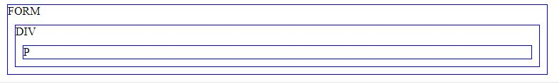
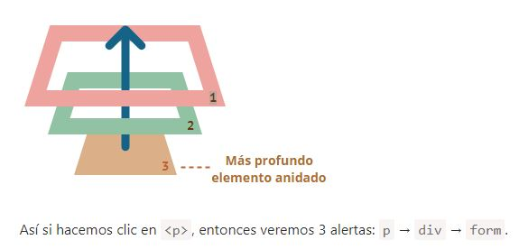
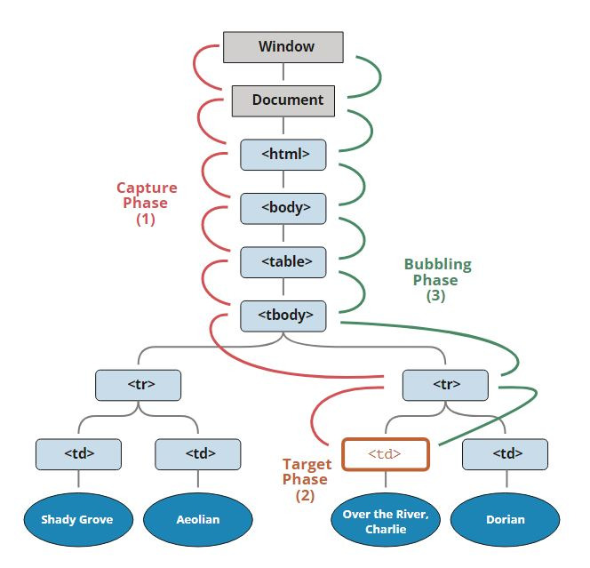

#Bubbling.
Event Bubbling es el término que las personas deben encontrar al desarrollar una aplicación web o una página web  
utilizando. Básicamente, el Event Bubbling es una técnica en la que se llama a los controladores de eventos cuando un  
elemento está anidado en otro elemento y debe ser del mismo evento.  
Es similar a la encapsulación.  
Event Bubbling es solo una pequeña parte del manejo de eventos en JavaScript.  

Bubbling quiere decir un evento que se propaga desde el elemento que ejecuto el evento(event.target),  
hasta el elemento mas lejano en la jerarquia que disponga del mismo evento. Osea, desde la fuente del evento  
hasta el ancestro mas lejano.

Para entenderlo mejor, tenemos que conocer la propagación de eventos y cómo es compatible con Event Bubbling.

#Propagación.
El principio de propagación es simple.  
Cuando un evento ocurre en un elemento, este primero ejecuta los manejadores que tiene asignados, luego los manejadores de su padre, y así hasta otros ancestros.  

  
Un clic en el elemento del interior <[p]> primero ejecuta onclick:  
- En ese <[p]>.  
- Luego en el <[div]> de arriba.  
- Luego en el <[form]> de más arriba.  
- Y así sucesivamente hasta el objeto document  
 
 Casi todos los elementos se propagan.
La palabra clave en esta frase es “casi”.  
Por ejemplo, un evento focus no se propaga.   Hay otros ejemplos también. Pero aún así, esta es la excepción a la regla, la mayoría de eventos sí se propagan.  

##event.target
Un manejador en un elemento padre siempre puede obtener los detalles sobre dónde realmente ocurrió el evento.  
El elemento anidado más profundo que causó el evento es llamado elemento objetivo, accesible como event.target  

- Nota la diferencia de this (=event.currentTarget):
  
event.target – es el elemento “objetivo” que inició el evento, no cambia a través de todo el proceso de propagación.  
this – es el elemento “actual”, el que tiene un manejador ejecutándose en el momento.  

Por ejemplo, si tenemos un solo manejador form.onclick, este puede atrapar todos los clicks dentro del formulario.  
No importa dónde el clic se hizo, se propaga hasta el <[form]> y ejecuta el manejador.  

En el manejador form.onclick:

this (=event.currentTarget) es el elemento <[form]>, porque el manejador se ejecutó en él.
event.target es el elemento actual dentro de el formulario al que se le hizo clic.

#Captura de eventos.
En esta fase, se llama a los oyentes capturadores cuyo valor se ha registrado como 'verdadero'. Está escrito como:  

- el.addEventListener('click', listener, true)  

Aquí, el valor de escucha se ha registrado como 'verdadero', por lo que se captura este evento. Si no había ningún valor, el  
valor predeterminado era falso y el evento no se capturaría. Entonces, en esta fase, ese evento cuyo valor es verdadero solo se abre camino desde la ventana y es llamado y capturado.  
Luego, en la fase de destino del evento, se llama a todos los oyentes registrados independientemente de que el estado de su bandera sea verdadero o falso.

Es raro usarla en código real, pero a veces puede ser útil.

El estándar de eventos del DOM describe 3 fases de la propagación de eventos:

- Fase de captura – el evento desciende al elemento.
- Fase de objetivo – el evento alcanza al elemento.
- Fase de propagación – el evento se propaga hacia arriba del elemento.  
  
Aquí está la imagen de un clic en <[td]> dentro de una tabla, tomada desde la especificación:  

Se explica así: por un clic en <[td]> el evento va primero a través de la cadena de ancestros hacia el elemento  
(fase de captura), luego alcanza el objetivo y se desencadena ahí (fase de objetivo), y por último  
va hacia arriba (fase de propagación), ejecutando los manejadores en su camino.  

Antes solo se hablo de la propagación porque la fase de captura es raramente usada. Normalmente es invisible a nosotros.

###Referencias.
>- [Event bubbling y el descontrol React](https://www.kuworking.com/javascript-que-es-event-bubbling)
>- [Generacion de eventos y captura de eventos en js](https://es.ichlese.at/event-bubbling-event-capturing-javascript#eventcapture)
>- [JavaScript.info](https://es.javascript.info/bubbling-and-capturing)
